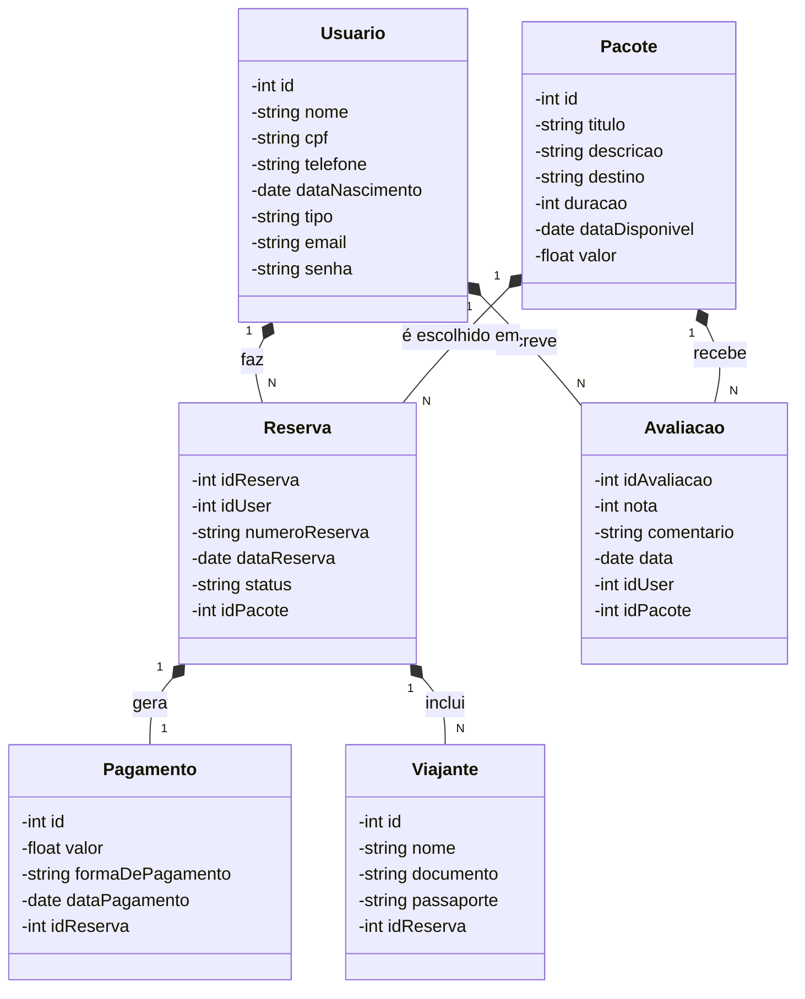

 ## ↗️ MODELAGEM DO PROJETO 

```mermaid
classDiagram

  class Usuario {
    -int id
    -string nome
    -string cpf
    -string telefone
    -date dataNascimento
    -string tipo
    -string email
    -string senha
  }

  class Reserva {
    -int idReserva
    -int idUser
    -string numeroReserva
    -date dataReserva
    -string status
    -int idPacote
  }

  class Avaliacao {
    -int idAvaliacao
    -int nota
    -string comentario
    -date data
    -int idUser
    -int idPacote
  }

  class Pacote {
    -int id
    -string titulo
    -string descricao
    -string destino
    -int duracao
    -date dataDisponivel
    -float valor
  }

  class Pagamento {
    -int id
    -float valor
    -string formaDePagamento
    -date dataPagamento
    -int idReserva
  }

  class Viajante {
    -int id
    -string nome
    -string documento
    -string passaporte
    -int idReserva
  }

  %% RELACIONAMENTOS
  Usuario "1" *-- "N" Reserva : faz
  Usuario "1" *-- "N" Avaliacao : escreve
  Pacote "1" *-- "N" Reserva : é escolhido em
  Pacote "1" *-- "N" Avaliacao : recebe
  Reserva "1" *-- "1" Pagamento : gera
  Reserva "1" *-- "N" Viajante : inclui
```
