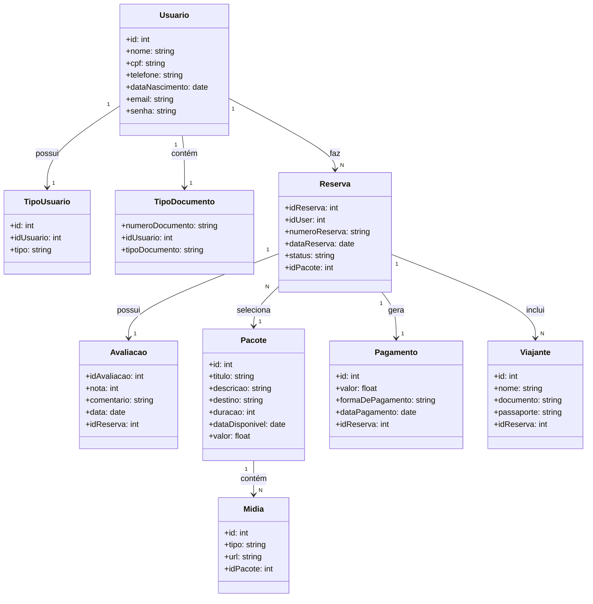

 ## ↗️ MODELAGEM DO PROJETO 

```mermaid
classDiagram

class Usuario {
  +id: int
  +nome: string
  +cpf: string
  +telefone: string
  +dataNascimento: date
  +email: string
  +senha: string
}

class TipoUsuario {
  +id: int
  +idUsuario: int
  +tipo: string
}

class TipoDocumento {
  +numeroDocumento: string
  +idUsuario: int
  +tipoDocumento: string
}

class Reserva {
  +idReserva: int
  +idUser: int
  +numeroReserva: string
  +dataReserva: date
  +status: string
  +idPacote: int
}

class Avaliacao {
  +idAvaliacao: int
  +nota: int
  +comentario: string
  +data: date
  +idReserva: int
}

class Pacote {
  +id: int
  +titulo: string
  +descricao: string
  +destino: string
  +duracao: int
  +dataDisponivel: date
  +valor: float
}

class Midia {
  +id: int
  +tipo: string
  +url: string
  +idPacote: int
}

class Pagamento {
  +id: int
  +valor: float
  +formaDePagamento: string
  +dataPagamento: date
  +idReserva: int
}

class Viajante {
  +id: int
  +nome: string
  +documento: string
  +passaporte: string
  +idReserva: int
}

%% ========= RELACIONAMENTOS =========

Usuario "1" --> "1" TipoUsuario : possui
Usuario "1" --> "1" TipoDocumento : contém
Usuario "1" --> "N" Reserva : faz

Reserva "1" --> "1" Avaliacao : possui
Reserva "1" --> "1" Pagamento : gera
Reserva "1" --> "N" Viajante : inclui
Reserva "N" --> "1" Pacote : seleciona

Pacote "1" --> "N" Midia : contém


```
